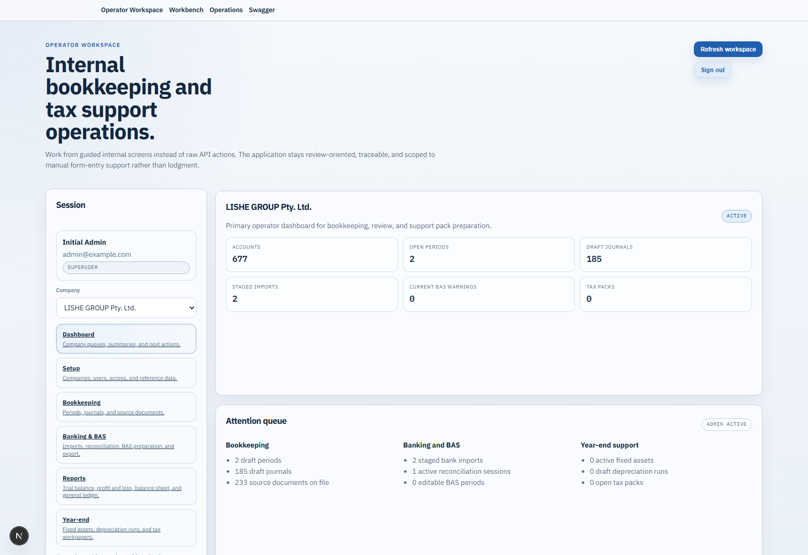
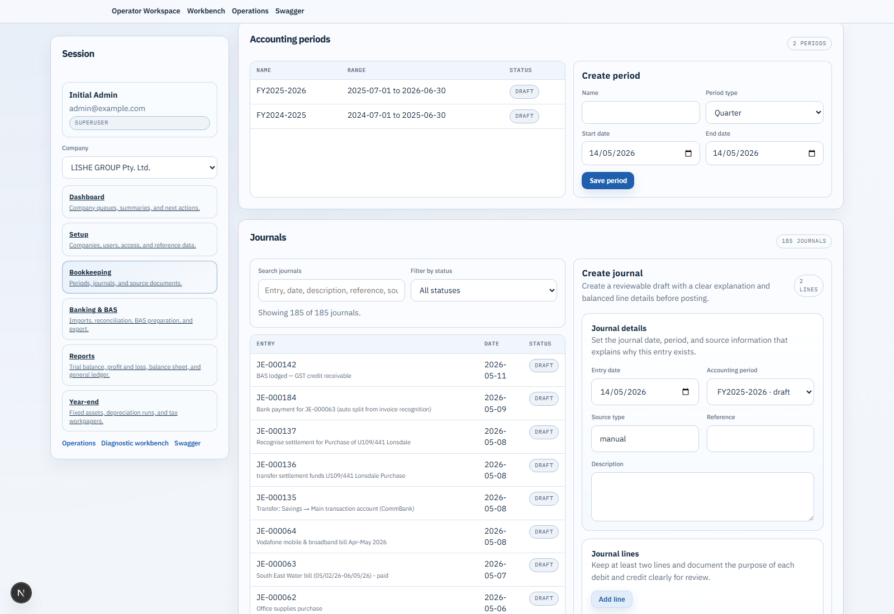
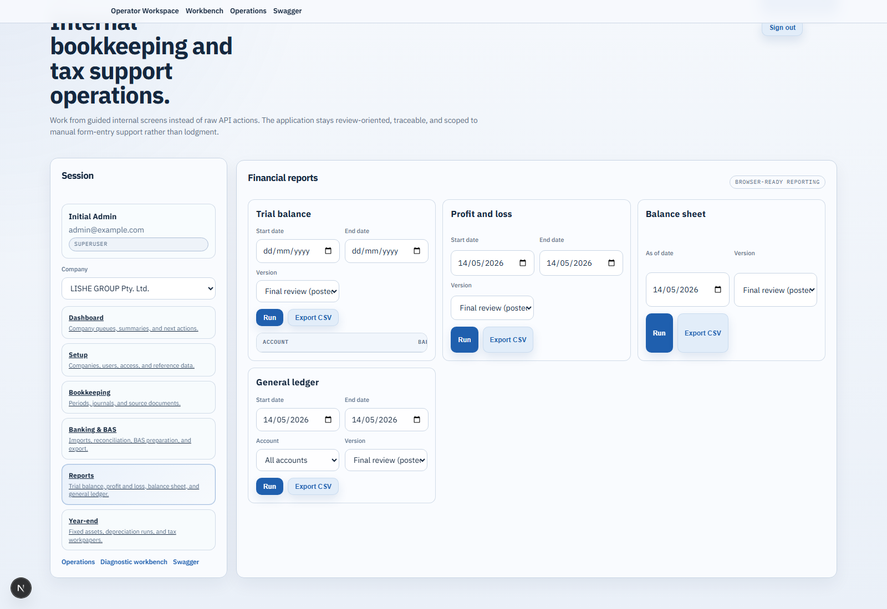
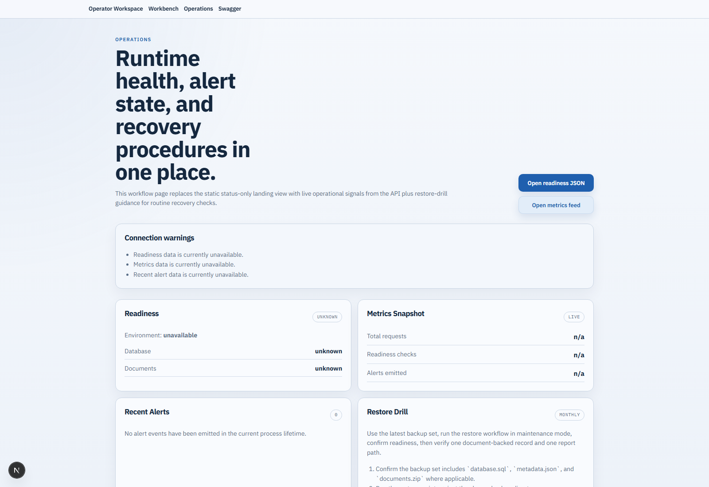

# Bookkeeping Tax

Internal bookkeeping and tax support system for Australian companies.

This project helps an internal team maintain bookkeeping records, prepare BAS support numbers, generate company tax workpapers, and assemble review packs for manual entry into ATO website forms or paper forms. It is review-oriented support software, not an ATO lodgment platform and not a replacement for accountant review.

## What The Project Does

The implemented system currently supports:

- company setup with versioned bookkeeping and reporting configuration
- chart of accounts, tax codes, and reporting categories
- balanced journal entry drafting, posting, reversal, and audit history
- source document upload, journal evidence linking, and document download
- bank CSV import staging, duplicate detection, confirmation, and reconciliation workflows
- BAS period generation, BAS runs, adjustments, review notes, approvals, and exports
- financial reporting including trial balance, profit and loss, balance sheet, and general ledger
- fixed asset register maintenance, disposals, depreciation runs, and depreciation journal posting
- annual company tax workpaper packs with adjustments, notes, exceptions, approvals, and exports
- operational health, metrics, alerts, backup and restore guidance, and a browser diagnostics workbench
- AI-assisted journal recommendation from uploaded invoice and receipt bundles, with human review before draft-journal creation

The project explicitly does not support:

- direct ATO lodgment
- tax-agent practice management
- payroll or STP lodgment
- bank scraping
- automatic finalization of tax returns without human review

## Product Principles

- Ledger first: reports and support packs are derived from accounting records, not raw bank data.
- Review before use: all BAS and tax outputs are support calculations only.
- Traceability: reported numbers should drill back to journals, lines, documents, imports, or adjustments.
- Auditability: workflow actions and important accounting changes should remain visible and explainable.
- No silent changes: approved or locked periods should not be altered invisibly.

## Functional Coverage

### Setup And Governance

- bootstrap the first admin user
- create companies and versioned company configurations
- manage company access permissions for prepare, review, approve, and administer roles
- maintain reporting categories, tax codes, and chart of accounts
- seed new companies from the supplied chart-of-accounts, tax-code, and reporting-category templates

### Ledger And Bookkeeping

- create draft journals
- post journals through the normal validation path
- reverse journals
- review journal detail including source type, lines, status, references, and audit-relevant metadata
- search and filter journal lists by text and status
- inspect a ledger explorer that can show both draft and posted lines for review

### Documents And Evidence

- upload supporting documents
- link documents to journals
- preview linked journal evidence inside Bookkeeping
- open full evidence views for images and PDFs without leaving the review workflow

### Banking And Reconciliation

- maintain bank accounts
- upload bank CSV files into staged import sessions
- review staged rows and duplicate protection
- confirm imports before reconciliation
- create reconciliation sessions, match rows to journals, ignore items, and complete sessions

### BAS Support

- generate BAS periods
- create BAS runs from accounting data
- review BAS totals, warnings, detail counts, adjustments, and review notes
- submit and approve BAS support workflows
- export BAS support packs

### Financial Reporting

- trial balance with date filtering and CSV export
- profit and loss with date filtering and CSV export
- balance sheet with current earnings and CSV export
- general ledger with account filtering, running balances, and CSV export
- per-report version selection so operators can run a final review version from posted journals only or a draft review version that includes draft journals

### Year-End Support

- fixed asset register maintenance
- asset disposal workflow
- straight-line and diminishing-value depreciation support
- depreciation-run generation, posting, and CSV export
- annual tax workpaper packs with manual adjustments, notes, exceptions, approvals, and PDF export
- financial-year locking as part of tax-workpaper approval workflows

### Operations And Diagnostics

- liveness and readiness endpoints
- Prometheus-style metrics
- recent alert feed
- structured request logging with correlation IDs
- browser operations dashboard
- browser workbench for direct API and workflow testing
- backup, restore, and restore-drill documentation under `infra/`

## Frontend Guide

The Next.js frontend is the main operator interface. It is organized around workflow routes rather than technical modules.

### First Use

1. Start the stack.
2. Open the frontend in the browser.
3. Bootstrap the first admin user if the system is empty.
4. Sign in.
5. Create or select a company.

### Dashboard: `/`

Use the dashboard as the operational summary for the selected company. It shows high-level counts such as open periods, draft journals, staged imports, BAS warnings, and tax packs, plus an attention queue across bookkeeping, banking, and year-end work.

### Setup: `/setup`

Use Setup to establish the bookkeeping foundation for a company.

Typical tasks:

1. Create or edit the company record.
2. Review the active configuration version.
3. Add or adjust reporting categories.
4. Add or adjust tax codes.
5. Create or maintain accounts in the chart of accounts.
6. Review access rows for the users who can prepare, review, approve, or administer work.

This is the route to visit before operational work if a company is new or its accounting settings have changed.

### Bookkeeping: `/bookkeeping`

Use Bookkeeping for day-to-day ledger work.

Typical tasks:

1. Create accounting periods.
2. Draft journals manually.
3. Post or reverse journals after review.
4. Search and filter journal lists.
5. Attach or review journal evidence.
6. Open the ledger explorer to inspect draft and posted journal lines.
7. Upload invoice or receipt bundles for AI journal recommendation.
8. Review the returned recommendation, assumptions, GST handling, extracted transaction date, and supporting sources.
9. Accept the recommendation to create a draft journal, then review and post through the normal bookkeeping workflow.

The AI path is assistive only. It does not silently post entries, and accepted recommendations create draft journals for review.

### Banking: `/banking`

Use Banking for imported transaction workflows and BAS support.

Typical tasks:

1. Create or edit bank accounts.
2. Upload a bank CSV file.
3. Review the staged import session.
4. Confirm the import when the rows look correct.
5. Create a reconciliation session.
6. Match or ignore reconciliation items.
7. Complete the session.
8. Generate BAS periods.
9. Create a BAS run for a selected BAS period.
10. Review BAS lines, warnings, adjustments, and notes.
11. Submit, approve, and export BAS support outputs.

### Reports: `/reports`

Use Reports for browser-ready financial outputs.

Available report panels:

- Trial balance
- Profit and loss
- Balance sheet
- General ledger

Each panel supports running the report in the browser and exporting CSV. The `Version` selector lets the user choose:

- `Final review (posted only)` for conservative reporting based on posted journals only
- `Draft review (include draft entries)` when the operator wants a work-in-progress view that includes draft journals

### Year-End: `/year-end`

Use Year-end for fixed asset support and company tax workpapers.

Typical tasks:

1. Create or update fixed assets.
2. Dispose of assets when needed.
3. Create depreciation runs and post them.
4. Export depreciation review data.
5. Create a tax workpaper pack for the year period.
6. Add manual tax adjustments, notes, and exception items.
7. Submit and approve the pack.
8. Create the PDF export for accountant review.

### Operations: `/operations`

Use Operations for support and runtime visibility. It summarizes readiness, metrics, recent alerts, and restore-drill guidance. This route is for operational support, not bookkeeping data entry.

### Workbench: `/workbench`

Use Workbench as a browser-based diagnostics console for calling implemented API workflows directly. It is useful for QA, support checks, and endpoint verification without writing ad hoc scripts.

## Screens/Workflows

The screenshots below were captured from the live local development environment and show the current operator interface with sample company data.

### Dashboard Overview

The dashboard gives operators a quick company-level summary of queues, draft work, staged imports, BAS warning counts, and year-end workload.



### Bookkeeping Workspace

Bookkeeping is the main day-to-day ledger screen for accounting periods, journal review, search and status filtering, evidence handling, and ledger inspection.



### Financial Reporting

The Reports route provides browser-ready trial balance, profit and loss, balance sheet, and general ledger panels, including the final-versus-draft version selector.



### Operations View

The Operations route exposes readiness, metrics, alerts, and recovery guidance for support and maintenance workflows.



## Repository Layout

```text
.
├── .testing/               manual QA and test-support notes
├── api/                    FastAPI backend, business logic, migrations, tests
├── docs/                   backlog and schema documentation
├── infra/                  deployment, backup, restore, and recovery documents
├── storage/                local development document storage
├── web/                    Next.js frontend
├── docker-compose.yml      local multi-service runtime
├── IMPLEMENTATION_PLAN.md  implementation record and handoff plan
├── chart_of_account_template.md
├── tax_codes.md
├── reporting_categories.md
└── README.md
```

## Architecture Summary

- frontend: Next.js 16, React 19, TypeScript
- backend: FastAPI, SQLAlchemy, Alembic
- database: PostgreSQL 16
- documents: local filesystem storage in development
- testing: pytest for backend, Playwright for browser workflows
- local orchestration: Docker Compose with `db`, `api`, `web`, and optional `e2e`

The development web service runs `next dev --webpack` and mounts `.next` to a dedicated container volume to avoid Windows bind-mount cache issues.

## Getting Started

### Prerequisites

- Docker and Docker Compose
- Node.js 22+
- Python 3.12+

### Environment Setup

Copy `.env.example` to `.env`.

Important variables:

- `API_DATABASE_URL`: backend database connection string
- `API_SECRET_KEY`: JWT signing key
- `OPENAI_API_KEY`: required only for AI journal recommendation analysis
- `API_JOURNAL_AI_WEB_SEARCH_ENABLED`: enables optional web-search support for recommendation runs
- `API_ALLOWED_ORIGINS` and `API_ALLOWED_ORIGIN_REGEX`: CORS configuration
- `API_LOG_LEVEL` and `API_LOG_JSON`: backend logging behavior
- `API_METRICS_ENABLED`: enable the metrics endpoint
- `API_ALERT_WEBHOOK_URL`: optional degraded-readiness alert target
- `NEXT_PUBLIC_API_BASE_URL`: leave blank when the browser should use the current hostname and `NEXT_PUBLIC_API_PORT`
- `NEXT_PUBLIC_API_PORT`: default API port used by the frontend

### Run Everything With Docker Compose

```bash
docker compose up --build
```

Expected local endpoints:

- frontend: `http://localhost:3000`
- backend API: `http://localhost:8000`
- Swagger docs: `http://localhost:8000/docs`
- PostgreSQL: `localhost:5432`

The API container runs Alembic migrations on startup before launching Uvicorn.

### LAN Access

The frontend can be reached from another device on the same LAN through the host machine IP, for example `http://192.168.x.x:3000`. By default, the frontend derives the API host from the current browser hostname, which makes LAN testing easier as long as the host firewall allows the published ports.

## Running Components Separately

### Backend

```bash
cd api
pip install -e .[dev]
python -m alembic upgrade head
uvicorn app.main:app --reload
```

Useful backend validation commands:

```bash
python -m pytest
python -m pytest tests/test_journal_recommendations.py
```

### Frontend

```bash
cd web
npm install
npm run dev
```

Useful frontend validation commands:

```bash
npm run build
npm run test:e2e
```

On this Windows environment, direct `node` invocation may be more reliable than package-manager shims if `next` or `playwright` are not recognized:

```bash
node node_modules/next/dist/bin/next build
node node_modules/playwright/cli.js test --reporter=line
```

### Browser E2E In Compose

```bash
docker compose --profile test up --build e2e
```

## Operational Endpoints

- `/health/live`
- `/health/ready`
- `/health`
- `/metrics`
- `/alerts/recent`

These are surfaced both through the API and through the frontend operations dashboard.

## Key Documents

- [IMPLEMENTATION_PLAN.md](IMPLEMENTATION_PLAN.md)
- [api/README.md](api/README.md)
- [docs/CORE_DATABASE_SCHEMA.md](docs/CORE_DATABASE_SCHEMA.md)
- [docs/PHASE_BACKLOG.md](docs/PHASE_BACKLOG.md)
- [infra/README.md](infra/README.md)
- [infra/BACKUP_AND_RESTORE.md](infra/BACKUP_AND_RESTORE.md)
- [infra/RESTORE_DRILL.md](infra/RESTORE_DRILL.md)

## Current Gaps And Follow-Up Areas

Current follow-up areas still visible in the project include:

- password reset and account recovery
- template-management UI for seeded reference data
- richer reconciliation assistance such as suggested matches or auto-created journals
- broader browser coverage for AI recommendation and evidence-heavy negative paths
- performance testing for import-heavy and report-heavy workflows

## Required Report Disclaimer

BAS and company tax support reports should display wording equivalent to:

> Internal calculation support only. This report does not lodge anything with the ATO and should be reviewed before manual form entry or submission.

## License

This repository is proprietary software of LISHE GROUP Pty. Ltd. and is distributed under the proprietary license in [LICENSE](LICENSE).
No open-source license is granted.
